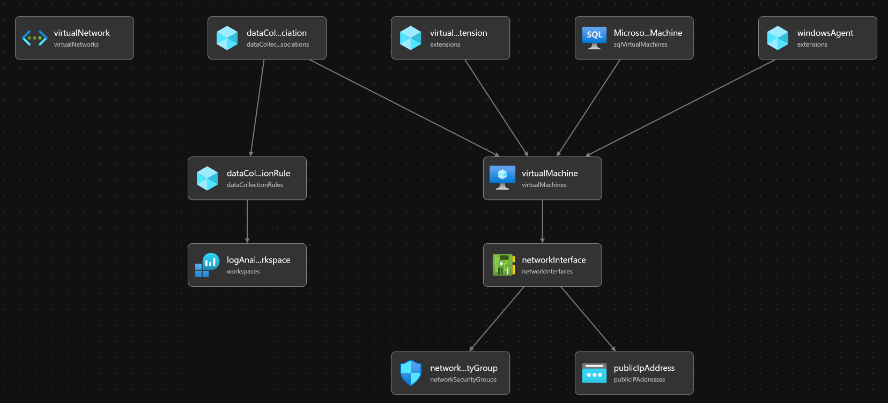
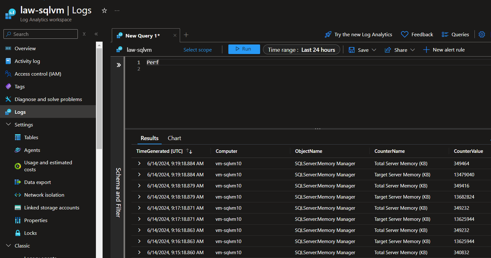

# sql-vm-dcr
The purpose of this repo is to test custom performance counters and to resolve an issue that was posted on [reddit](https://www.reddit.com/r/AZURE/comments/1dddpxz/issue_setting_up_custom_performance_counters/).

We are using the following performance counters:

```
\SQLServer:Memory Manager\Total Server Memory (KB)
\SQLServer:Memory Manager\Target Server Memory (KB)
```

## Deployment with PowerShell
The deployment creates a new resource group, asks the user for the SQL Server admin password, and then creates resources to log the custom performance counters..

``` PowerShell
Connect-AzAccount

$resourceGroupName = "rg-sqlvm"
$location = "westeurope"

New-AzResourceGroup -Name $resourceGroupName -Location $location

$adminPassword = Read-Host "Enter the password for the SQL Server admin account" -AsSecureString
New-AzResourceGroupDeployment -Name sqldeployment -ResourceGroupName $resourceGroupName -TemplateFile ./main.bicep -TemplateParameterFile ./main.parameters.json -location $location -existingVnetResourceGroup $resourceGroupName -adminPassword $adminPassword
```

The bicep script creates the following resources.


## Testing the DCR

